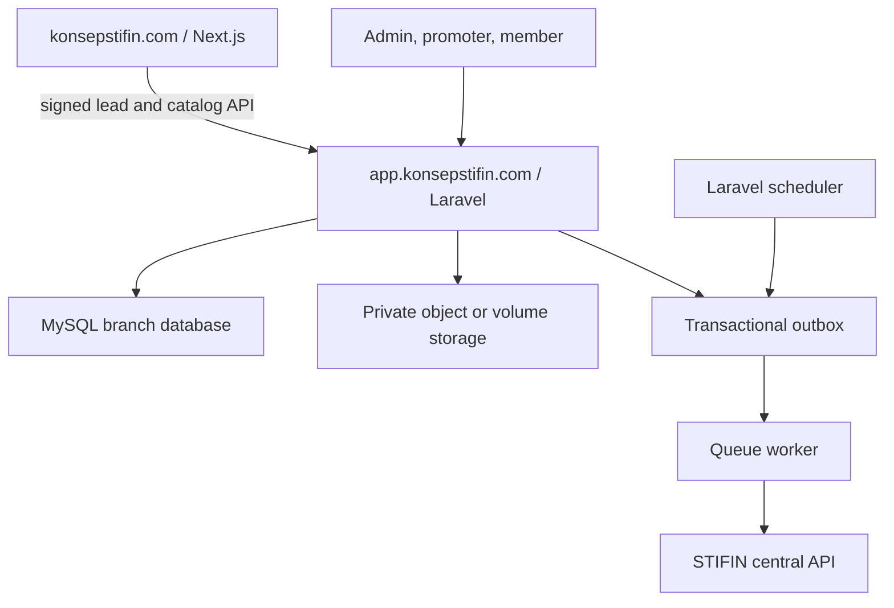
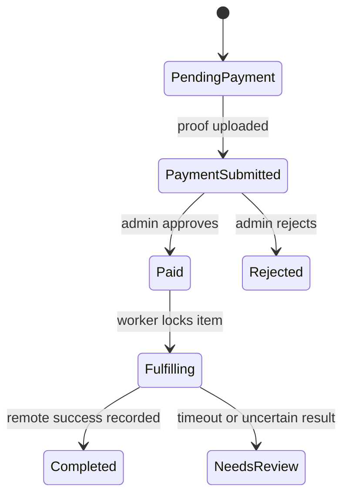

# STIFLow Architecture

## Runtime topology

The public and operational applications are deployed independently. STIFLow owns identity, orders, payments, and fulfillment. The public site does not write directly to transactional tables.

## Module boundaries

| Module | Owns | Calls externally |
|---|---|---|
| Identity | accounts, roles, permissions, sessions | none |
| Branch | branch code, branding, bank details | none |
| Promoter | profile, STIFIN code, verification status | STIFIN read through adapter |
| Orders | products, price snapshots, orders, items | none |
| Payments | attempts, proofs, approval/rejection | payment provider adapter in Phase 2 |
| Voucher | balances, write request, result, reconciliation | STIFIN adapter |
| Operations | outbox, audit log, health, reconciliation | notifications through adapters |

Controllers call application services. Only adapters in `app/Integrations` call external systems. Credentials come from encrypted integration records or environment configuration, never request payloads.

## Voucher state flow

The `NeedsReview` state is terminal for automation. A human resolves it by comparing the remote balance and request reference; resolution records an audit event. It must not dispatch the original POST again.

## Deployment isolation

- One installation equals one branch.
- No `tenant_id` is required because database and storage are isolated per deployment.
- Web, worker, and scheduler processes use the same immutable image and release version.
- Secrets are supplied through deployment environment variables.
- Asset compilation occurs during image build; Node.js is not required at runtime.
- A release migration is preceded by backup and followed by a health check.
