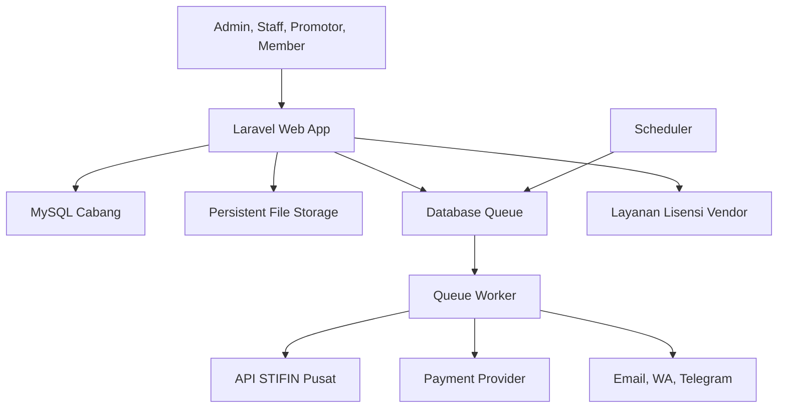
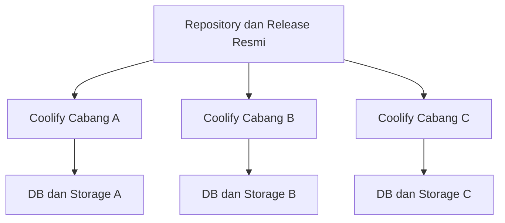
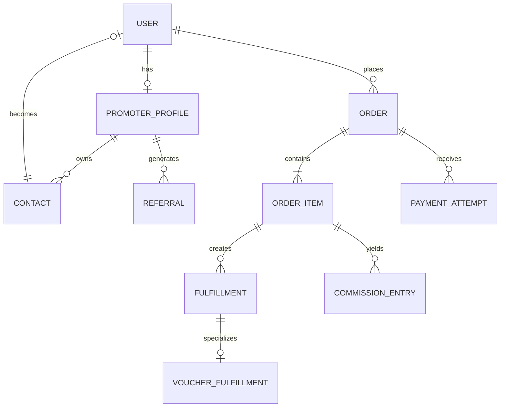
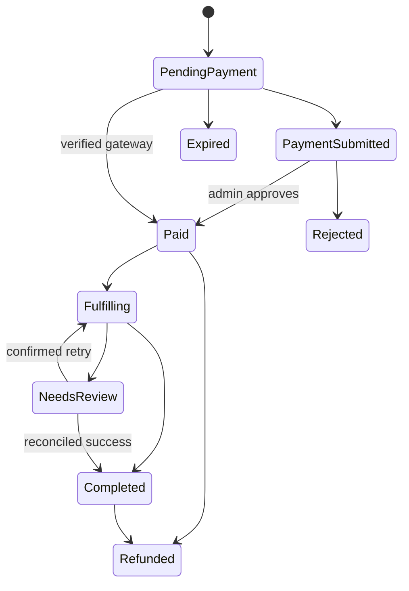
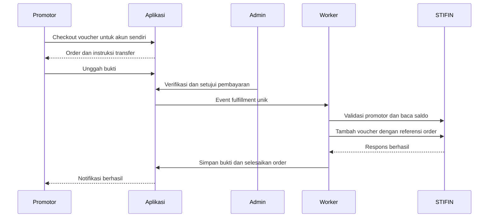
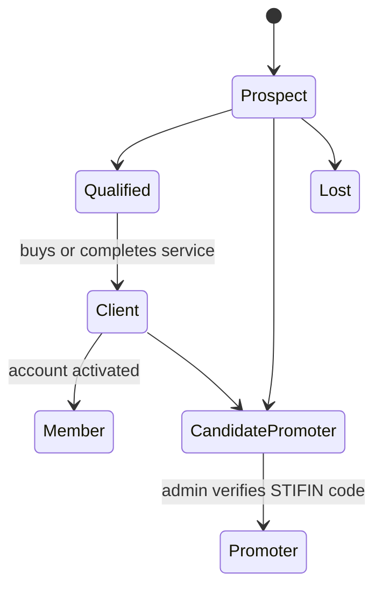

# Arsitektur Lengkap Platform Membership Cabang dan Voucher STIFIN

**Status:** Disetujui untuk dijadikan dasar perencanaan implementasi
**Tanggal:** 6 September 2026
**Jenis dokumen:** Arsitektur induk dan spesifikasi produk
**Nama teknis sementara:** Branch Membership Platform
**Model distribusi:** Satu source, instalasi terpisah untuk setiap BM/cabang

---

## 1. Ringkasan Eksekutif

Platform ini adalah aplikasi web mandiri untuk BM/cabang STIFIN. Aplikasi tidak menggunakan WordPress dan tidak menjadikan SEJOLI sebagai fondasi. Dua plugin lama hanya digunakan sebagai referensi untuk memahami alur bisnis, struktur integrasi voucher, dan perilaku yang perlu dipertahankan.

Setiap BM memasang satu instance aplikasi melalui Coolify. Instance tersebut memiliki domain, database, penyimpanan, branding, rekening, integrasi pembayaran, kredensial STIFIN, layanan email, dan layanan WhatsApp sendiri. Tidak ada database operasional bersama antarcabang.

Fungsi utama platform:

1. Promotor membeli voucher untuk kode STIFIN miliknya sendiri.
2. Pembayaran manual diverifikasi admin sebelum voucher dikirim ke STIFIN.
3. BM mengelola promotor, prospek, klien, aktivitas tindak lanjut, dan konversi prospek.
4. Cabang menjual kelas, membership, produk digital, acara, dan layanan.
5. Member memperoleh area belajar, hasil STIFIN, pesan, produk, unduhan, dan promo.
6. Promotor menjalankan referral dan affiliate bertingkat untuk produk yang memenuhi syarat.
7. Cabang menjalankan kampanye email dan WhatsApp melalui provider pilihannya.
8. Seluruh sistem dapat diberi branding cabang, diperbarui secara aman, dan didistribusikan sebagai produk berlisensi.

Arsitektur yang dipilih adalah **modular monolith berbasis Laravel**. Pendekatan ini memberi pemisahan modul yang jelas tanpa kompleksitas microservices. Queue worker dan scheduler tetap dipisahkan sebagai proses runtime agar transaksi, pengiriman voucher, kampanye, dan otomatisasi tidak membebani request web.

Prinsip tertinggi pada transaksi voucher adalah **tepat satu kali secara lokal dan tidak menebak hasil remote**. Bila request penambahan voucher ke STIFIN mengalami timeout setelah terkirim, sistem tidak mengulang otomatis. Transaksi masuk ke `needs_review` agar tidak menambah saldo dua kali.

---

## 2. Keputusan yang Telah Dikunci

| Area | Keputusan |
|---|---|
| Fondasi | Dibangun ulang tanpa WordPress |
| Source lama | Referensi perilaku dan kontrak integrasi saja |
| Deployment | Satu repository; satu instance terpisah per BM/cabang |
| Arsitektur | Laravel modular monolith |
| Antarmuka | Blade, Livewire, dan design system responsif |
| Database | MySQL per instalasi |
| Queue awal | Database queue dengan worker terpisah |
| Scheduler | Laravel scheduler sebagai proses terpisah |
| Pembayaran awal | Transfer manual dan verifikasi admin |
| Payment gateway | Adapter modular; dipasang bertahap |
| Pembeli voucher | Hanya promotor terverifikasi |
| Tujuan voucher | Hanya kode STIFIN milik promotor yang login |
| Kuantitas voucher | Preset 1, preset 5, atau jumlah bebas dalam batas admin |
| Akun BM pusat | Tidak dimasukkan sebagai akun pembeli voucher |
| CRM | CRM umum dan dapat dikonfigurasi, bukan CRM khusus STIFIN |
| Prospek | Dapat masuk lewat link/QR referral atau input manual promotor |
| Affiliate | Bertingkat dan jumlah level dapat diatur admin |
| Voucher dan komisi | Pembelian voucher sendiri tidak menghasilkan komisi |
| Member | Memiliki akun untuk kelas, hasil, produk, pesan, dan promo |
| Email | Mailketing, Kirim.Email, SMTP, dan adapter tambahan |
| WhatsApp | OneSender, StarSender, dan adapter tambahan |
| Data kontak | Aplikasi menjadi sumber data utama; provider hanya transport/sinkronisasi |
| White-label | Branding penuh per instalasi |
| Update | Rilis GitHub/Coolify berbasis versi dengan backup dan rollback |
| Risiko | Implementasi bertahap; jalur voucher dibangun dan diuji lebih dahulu |

---

## 3. Tujuan dan Batas Sistem

### 3.1 Tujuan

- Memberi setiap BM/cabang website membership milik sendiri.
- Mengurangi proses manual pembelian voucher oleh promotor.
- Menyatukan transaksi, member, CRM, LMS, affiliate, dan komunikasi.
- Memungkinkan cabang memilih provider pembayaran serta pesan sendiri.
- Menyediakan source yang dapat dipasang berulang melalui Coolify.
- Menjaga data dan kredensial setiap cabang tetap terisolasi.
- Menyediakan jejak audit lengkap untuk aktivitas bernilai finansial.

### 3.2 Bukan tujuan

- Aplikasi tidak menggantikan sistem pusat STIFIN.
- Aplikasi tidak mengelola akun STIFIN milik BM/cabang pusat.
- Aplikasi tidak membuat saldo voucher internal sebagai pengganti saldo pusat.
- Aplikasi tidak menyatukan database seluruh BM dalam satu SaaS.
- Aplikasi tidak menyalin hook, tabel, lisensi, updater, atau UI WordPress dari SEJOLI.
- Aplikasi tidak menjamin exactly-once pada server STIFIN jika API pusat tidak menyediakan idempotency. Aplikasi menjamin pencegahan duplikasi lokal dan eskalasi aman ketika hasil remote tidak pasti.
- Aplikasi tidak mengirim email atau WhatsApp langsung tanpa provider yang dikonfigurasi.

### 3.3 Asumsi operasional

- Setiap instalasi mewakili tepat satu BM/cabang.
- Instalasi memiliki satu kode cabang STIFIN aktif.
- Setiap promotor mempunyai satu kode STIFIN yang unik, misalnya `KHU-ABU-02`.
- Satu kode STIFIN hanya dapat ditautkan ke satu akun promotor aktif pada satu instalasi.
- Kredensial dan akses API STIFIN disediakan oleh pihak yang berwenang untuk cabang tersebut.
- Kontrak API hasil audit harus diverifikasi terhadap server/sandbox STIFIN sebelum transaksi produksi diaktifkan.

---

## 4. Temuan Audit Source Lama

### 4.1 Source utama

Source `sejoli.zip` adalah plugin WordPress SEJOLI versi 1.15.5. Plugin ini bergantung pada WordPress untuk user, hook, cron, database, admin UI, routing, dan lifecycle aplikasi. Karena target baru tidak memakai WordPress, source ini tidak digunakan sebagai fondasi kode.

### 4.2 Source voucher

Source `sejoli-stifin-voucher.zip` adalah plugin pendamping versi 0.10.1. Plugin ini menunjukkan alur integrasi voucher tetapi tetap bergantung pada hook dan model SEJOLI/WordPress.

Kontrak yang ditemukan:

| Operasi | Method dan path yang diamati |
|---|---|
| Daftar promotor cabang | `GET /proGetCab/pro/{branchCode}` |
| Total/saldo voucher promotor | `GET /voucherGet/getTotVoucher/{promoterCode}` |
| Penambahan voucher | `POST /voucherPos/editCabVoucher/{branchCode}` |

Base URL bawaan yang ditemukan: `https://apro.stifin.id/api`.

Payload penambahan voucher yang diamati:

```json
{
  "KodeID": "KHU-ABU-02",
  "Jumlah": 1,
  "JmlFree": 0,
  "SaldoJ": 0,
  "SaldoF": 0,
  "Dispos": "ORDER-UNIK",
  "Ket": "Pembelian voucher dari web cabang",
  "UserID": "IDENTITAS-SISTEM"
}
```

Interpretasi nama field:

- `KodeID`: kode promotor tujuan.
- `Jumlah`: voucher berbayar yang ditambahkan.
- `JmlFree`: voucher gratis/bonus.
- `SaldoJ`: snapshot saldo berbayar yang dibaca sebelum request.
- `SaldoF`: snapshot saldo gratis yang dibaca sebelum request.
- `Dispos`: referensi transaksi unik.
- `Ket`: keterangan transaksi.
- `UserID`: identitas operator/sistem pengirim.

Interpretasi tersebut berasal dari source dan penamaan field, bukan dokumentasi API resmi. Semua field dipertahankan dalam adapter awal tetapi pemetaan akhirnya harus dikonfirmasi pada uji integrasi resmi.

### 4.3 Risiko source lama yang tidak boleh diwarisi

- Ketergantungan ketat terhadap WordPress.
- Updater dan validasi lisensi vendor lama.
- Konfigurasi integrasi yang tidak terisolasi dengan baik.
- Pola koneksi lama yang berpotensi melemahkan verifikasi TLS.
- Tidak ada kontrak respons API formal.
- Tidak ada jaminan idempotency dari API pusat.
- Tidak ada rekonsiliasi transaksi remote yang kuat.

---

## 5. Arsitektur Tingkat Tinggi



### 5.1 Komponen runtime per cabang

1. **Web application**
   Menangani halaman publik, autentikasi, admin panel, member area, API internal, webhook, dan validasi input.

2. **Queue worker**
   Menangani pengiriman voucher, notifikasi, kampanye, sinkronisasi provider, pemberian akses produk, dan proses yang tidak boleh memperlambat request pengguna.

3. **Scheduler**
   Membuat job untuk pesanan kedaluwarsa, follow-up, autoresponder, kampanye terjadwal, pengingat tugas, retensi data teknis, dan pengecekan kesehatan integrasi.

4. **MySQL**
   Menyimpan seluruh data operasional satu cabang, termasuk database queue pada fase awal.

5. **Persistent storage**
   Menyimpan logo, materi kelas, produk digital, bukti transfer, lampiran CRM, dan hasil STIFIN. File privat tidak berada pada direktori publik.

6. **Provider eksternal**
   STIFIN, payment gateway, email, WhatsApp, Telegram, object storage opsional, dan layanan lisensi aplikasi.

### 5.2 Alasan modular monolith

- Satu source dan satu deployment lebih mudah dijual serta didukung.
- Transaksi database antar-modul tetap atomik.
- Biaya operasional lebih rendah daripada microservices.
- Batas modul tetap eksplisit melalui service contract dan event internal.
- Modul provider dapat diganti tanpa mengubah domain utama.
- Jika skala tumbuh, worker atau modul komunikasi dapat dipisahkan kemudian tanpa mendesain ulang data inti.

### 5.3 Teknologi

- PHP dan Laravel versi stabil yang masih didukung, dikunci melalui `composer.lock`.
- Blade dan Livewire untuk UI server-driven yang responsif.
- Tailwind CSS atau design tokens yang dikompilasi pada image build.
- MySQL 8 atau versi kompatibel yang didukung Laravel.
- Database queue untuk rilis awal; Redis dapat ditambahkan tanpa mengubah domain.
- PHPUnit/Pest untuk pengujian backend dan Laravel Dusk/Playwright untuk alur end-to-end bila diperlukan.
- Dockerfile produksi dan konfigurasi proses yang kompatibel dengan Coolify.

Tidak ada ketergantungan Node.js pada server runtime. Proses build aset dilakukan saat image dibuat.

---

## 6. Topologi Instalasi Cabang



Setiap deployment:

- Memiliki `INSTALLATION_ID` yang unik.
- Memiliki tepat satu `BRANCH_CODE`.
- Tidak membutuhkan `tenant_id` pada setiap tabel karena isolasi terjadi pada level deployment dan database.
- Menyimpan secret sendiri melalui environment/secret manager Coolify.
- Menggunakan domain dan sertifikat TLS sendiri.
- Menggunakan volume atau object storage sendiri.
- Dapat menjalankan versi stabil yang sama atau tertahan sementara pada versi sebelumnya saat rollback.

Repository tidak menyimpan `.env`, private key, token, database dump, file pelanggan, atau kredensial provider.

---

## 7. Batas Modul dan Tanggung Jawab

| Modul | Tanggung jawab utama | Tidak bertanggung jawab atas |
|---|---|---|
| Identity & Access | User, login, OTP, 2FA, role, permission, session | Aturan pembelian |
| Branch & Branding | Profil cabang, domain, logo, warna, dokumen | Data pusat STIFIN |
| Promoter | Profil promotor, kode STIFIN, sponsor, status verifikasi | Penambahan voucher langsung |
| CRM | Kontak, pipeline, stage, tugas, aktivitas, tag, custom field | Pengiriman massal provider |
| Catalog | Produk, harga, visibilitas, varian, entitlement | Penerimaan pembayaran |
| Checkout & Orders | Checkout, item, harga snapshot, status order | Detail protokol provider |
| Payments | Pembayaran manual, bukti, adapter PG, webhook | Fulfillment produk |
| STIFIN Voucher | Validasi promotor, saldo, request voucher, rekonsiliasi | Harga dan kupon |
| Fulfillment | Koordinasi akses setelah pembayaran | Logika spesifik tiap produk |
| Affiliate | Referral, tree, aturan komisi, ledger, payout | Mengubah order yang sudah dibayar |
| LMS | Course, lesson, quiz, enrollment, progress | Penagihan |
| Digital Delivery | Asset, grant, signed URL, download limit | Penyimpanan pembayaran |
| Product Licensing | Key produk, aktivasi, revoke | Lisensi aplikasi cabang |
| Rewards | Ledger poin, earn, redeem, expire | Saldo voucher STIFIN |
| Messaging | Template, list, segment, campaign, automation | Kepemilikan master kontak |
| Integrations | Credential terenkripsi, health check, provider config | Domain business rule |
| Analytics | Agregasi dan laporan | Mengubah transaksi sumber |
| Audit & Operations | Audit log, failed operation, reconciliation UI | Menjalankan rule bisnis utama |
| Application Licensing | Aktivasi instalasi dan hak update | License key produk yang dijual |

Komunikasi antarmodul dilakukan melalui application service, interface adapter, dan domain event. Controller tidak boleh memanggil SDK/provider eksternal secara langsung.

---

## 8. Model Pengguna dan Hak Akses

### 8.1 Peran

| Peran | Cakupan |
|---|---|
| Owner/Admin Cabang | Seluruh konfigurasi dan data operasional cabang |
| Staff | Izin granular sesuai tugas |
| Promotor | Voucher sendiri, kontak sendiri, referral, penjualan dan komisi sendiri |
| Member/Klien | Profil sendiri, pesanan, kelas, hasil, unduhan, pesan dan poin sendiri |
| Prospek | Record CRM; akun login belum wajib |

### 8.2 Aturan identitas

- Akun admin/staff tidak dapat digabung dengan akun pembeli voucher.
- Akun promotor harus mempunyai satu `promoter_profile` aktif dan terverifikasi.
- `stifin_promoter_code` unik, tidak dapat diedit sendiri, dan perubahan oleh admin tercatat.
- Promotor tidak dapat memilih kode tujuan saat checkout voucher. Kode diambil dari profil server-side.
- Kontak CRM dapat berubah menjadi member tanpa membuat record orang baru.
- Kontak CRM dapat diproses menjadi calon promotor; aktivasi promotor tetap membutuhkan verifikasi admin dan kode STIFIN yang sah.
- Member dapat menjadi promotor melalui proses konversi yang tercatat, bukan dengan mengubah role sendiri.

### 8.3 Permission staff

Izin dipisahkan minimal menjadi:

- `users.manage`
- `promoters.view`, `promoters.manage`, `promoters.verify`
- `contacts.view_all`, `contacts.manage_all`, `contacts.reassign`
- `orders.view`, `orders.manage`
- `payments.verify`, `payments.refund`
- `vouchers.view`, `vouchers.review`, `vouchers.retry_confirmed`
- `products.manage`
- `courses.manage`
- `affiliate.manage`, `payouts.approve`
- `campaigns.manage`, `campaigns.send`
- `integrations.manage`
- `settings.manage`
- `audit.view`

Pemilik cabang memiliki seluruh permission. Staff menerima role berbasis permission. Promotor dan member menggunakan policy khusus, bukan permission admin.

---

## 9. Model Data Inti

### 9.1 Identitas dan cabang

| Tabel | Field penting |
|---|---|
| `users` | id, name, email, phone, password, status, email_verified_at, phone_verified_at, last_login_at |
| `roles`, `permissions` | nama dan relasi role-permission |
| `branch_settings` | branch_code, brand_name, legal_name, contact, address, locale, timezone, currency |
| `brand_settings` | logo, favicon, palette, typography, footer, login appearance |
| `integration_connections` | provider_type, provider_name, encrypted_credentials, config, status, last_tested_at |
| `audit_logs` | actor, action, subject, before, after, IP, user_agent, correlation_id, timestamp |

### 9.2 Promotor, referral, dan CRM

| Tabel | Field penting |
|---|---|
| `promoter_profiles` | user_id, stifin_code, sponsor_promoter_id, verification_status, verified_at, referral_slug |
| `contacts` | owner_promoter_id, user_id opsional, name, email, phone, source, status, pipeline_stage_id |
| `pipelines`, `pipeline_stages` | konfigurasi pipeline umum dan urutan stage |
| `custom_fields`, `contact_custom_values` | field dinamis dan nilai per kontak |
| `tags`, `contact_tag` | segmentasi fleksibel |
| `contact_activities` | type, note, actor, occurred_at, metadata |
| `crm_tasks` | assignee, contact, due_at, priority, status, reminder |
| `referral_links` | promoter_id, code, destination, campaign, active |
| `referral_visits` | link_id, anonymous token, landing URL, timestamp, attribution data terbatas |
| `referrals` | referred_contact/user, direct_promoter_id, source, converted_at |

### 9.3 Produk, order, dan pembayaran

| Tabel | Field penting |
|---|---|
| `products` | type, name, slug, status, visibility, price, commission_eligible, points policy |
| `product_variants` | product_id, name, SKU, price override, stock/access config |
| `voucher_product_configs` | product_id, unit_price, min_qty, max_qty, presets, free_units rule |
| `order_bumps` | source_product, offered_product, price override, active window |
| `orders` | number, user, referral snapshot, currency, subtotal, discount, total, status, timestamps |
| `order_items` | product snapshot, quantity, unit price, discount, total, fulfillment type |
| `payment_attempts` | order, method, provider, amount, status, external reference, timestamps |
| `payment_proofs` | attempt, private file, bank, sender, transfer time, review status |
| `payment_webhook_events` | provider event ID, signature status, payload hash, process status |
| `coupons` | code, type, value, limits, dates, scope, status |
| `coupon_redemptions` | coupon, order, user, amount, timestamp |

### 9.4 Voucher dan fulfillment

| Tabel | Field penting |
|---|---|
| `fulfillments` | order_item, type, status, attempt count, correlation_id, completed_at |
| `voucher_fulfillments` | fulfillment, promoter_id, code snapshot, paid units, free units, pre/post balance |
| `stifin_operations` | operation type, request reference, request hash, redacted payload, response, HTTP status, outcome |
| `reconciliation_cases` | subject, reason, evidence, assigned_to, status, resolution, timestamps |
| `outbox_events` | event type, aggregate, payload, available_at, processed_at |

### 9.5 Affiliate dan rewards

| Tabel | Field penting |
|---|---|
| `commission_plans` | name, max_levels, active dates, status |
| `commission_rules` | plan, level, calculation type, value, product scope |
| `order_referral_snapshots` | order, direct referrer, ancestry JSON, plan/rate snapshot |
| `commission_entries` | order item, beneficiary, level, amount, status, available_at |
| `payouts`, `payout_items` | promoter, period, total, approval, proof, paid_at |
| `point_ledger_entries` | user, type, delta, balance_after, source, expiry, reversal reference |

### 9.6 LMS, digital product, dan lisensi produk

| Tabel | Field penting |
|---|---|
| `courses`, `course_modules`, `lessons` | struktur kelas, urutan, status, access policy |
| `enrollments` | user, course, source order/admin, started, expires, completed |
| `lesson_progress` | enrollment, lesson, progress, completed_at |
| `quizzes`, `quiz_questions`, `quiz_attempts` | evaluasi sederhana dan skor |
| `stifin_results` | client, type, result data, private report, recorded_by, visibility |
| `digital_assets` | product, private storage path, version, checksum, status |
| `download_grants` | user, asset, order, token, expiry, max downloads, count |
| `product_license_keys` | product, key hash/encrypted value, status, assigned order/user |
| `product_license_activations` | key, installation fingerprint, status, activated_at |

### 9.7 Komunikasi

| Tabel | Field penting |
|---|---|
| `contact_subscriptions` | contact, channel, address, status, consent source, unsubscribed_at |
| `contact_lists`, `contact_list_members` | daftar kontak dan keanggotaan |
| `segments` | filter JSON tervalidasi dan status |
| `message_templates` | channel, subject, body, variables, version, status |
| `campaigns` | channel, audience, template snapshot, schedule, status |
| `campaign_recipients` | campaign, contact, resolved address, status |
| `automation_flows` | trigger, conditions, status |
| `automation_steps` | flow, position/branch, action, delay, config |
| `automation_runs` | flow, contact, current step, status, timestamps |
| `message_deliveries` | provider, recipient, external ID, status, attempts, timestamps |
| `provider_webhook_events` | provider event ID, signature, payload hash, status |

### 9.8 Relasi domain utama



---

## 10. Katalog, Produk, dan Hak Akses

### 10.1 Jenis produk

| Jenis | Pembeli | Fulfillment |
|---|---|---|
| Voucher STIFIN | Promotor terverifikasi | Penambahan voucher ke akun STIFIN promotor |
| Kelas/LMS | Publik, member, atau promotor | Enrollment otomatis |
| Produk digital | Publik, member, atau promotor | Download grant aman |
| Acara/layanan | Publik, member, atau promotor | Tiket/konfirmasi/penanganan staff |
| Membership | Publik, member, atau promotor | Hak akses dengan periode berlaku |

### 10.2 Visibilitas

- Produk voucher hanya muncul bagi promotor aktif.
- Produk umum dapat bersifat publik, login-only, segment-only, atau hidden-link.
- Admin dapat membatasi produk menurut tag/segment, periode, atau status member.
- Harga dan konfigurasi produk di-snapshot ke order agar riwayat tidak berubah ketika produk diedit.

### 10.3 Checkout

Rilis awal menggunakan direct checkout per produk. Tidak ada shopping cart multi-produk kompleks. Order bump menjadi item tambahan pada checkout yang sama.

Untuk produk umum:

- Pengunjung dapat checkout dengan identitas minimal.
- Akun member dibuat/ditautkan setelah order sesuai kebijakan autentikasi.
- Referral dikunci saat checkout dan di-snapshot saat order dibayar.

Untuk voucher:

- Login wajib.
- Policy memastikan user adalah promotor aktif.
- Kode tujuan selalu diambil dari profil server-side.
- Quantity tervalidasi terhadap min/max produk.
- Preset UI 1 dan 5 tersedia; input bebas tetap divalidasi.
- Nilai voucher = quantity × unit per item, dengan bonus bila rule aktif.

### 10.4 Kupon dan order bump

Kupon mendukung:

- Nilai tetap atau persentase.
- Nilai maksimum diskon.
- Minimum order.
- Produk/jenis produk tertentu.
- Periode berlaku.
- Batas global dan batas per user.
- Segment/member tertentu.
- Satu kupon per order pada fase awal.

Order bump:

- Ditentukan per produk utama.
- Harga bump di-snapshot saat dipilih.
- Tidak boleh menambahkan produk voucher ke checkout publik.

---

## 11. State Machine Order dan Pembayaran

### 11.1 Status order



Nama status penyimpanan menggunakan snake case:

- `pending_payment`
- `payment_submitted`
- `paid`
- `fulfilling`
- `completed`
- `needs_review`
- `rejected`
- `expired`
- `cancelled`
- `refunded`

### 11.2 Pembayaran manual

1. Pembeli membuat order.
2. Sistem menampilkan rekening cabang dan kode order.
3. Pembeli mengunggah bukti transfer pada penyimpanan privat.
4. Sistem mencatat `payment_submitted` dan memberi notifikasi admin.
5. Staff berizin memeriksa nominal, rekening, waktu, dan identitas pengirim.
6. Staff menyetujui atau menolak disertai alasan.
7. Persetujuan memakai database transaction dan row lock.
8. Perubahan pertama ke `paid` membuat satu outbox event fulfillment.
9. Persetujuan berulang tidak membuat event tambahan.

Admin tidak boleh mengubah order langsung menjadi `completed`. Fulfillment harus berjalan dan tercatat.

### 11.3 Payment gateway masa depan

Semua provider mengimplementasikan interface:

- `createPayment(Order): PaymentInstruction`
- `parseWebhook(Request): VerifiedPaymentEvent`
- `queryPayment(reference): PaymentStatus`
- `refund(PaymentAttempt, amount): RefundResult` jika didukung
- `testConnection(): ConnectionHealth`

Adapter awal masa depan dapat mencakup Duitku, Midtrans, Xendit, Tripay, dan Moota. Hanya provider yang dipilih cabang yang diaktifkan. Core order tidak bergantung pada nama provider.

Webhook wajib:

- Diverifikasi signature dan timestamp.
- Menyimpan ID event unik.
- Menolak replay atau payload tidak sah.
- Bersifat idempotent.
- Membandingkan amount, currency, order number, dan merchant account.

---

## 12. Alur Voucher STIFIN

### 12.1 Alur normal



### 12.2 Validasi sebelum POST

Worker wajib memastikan:

1. Order berstatus `paid` atau `fulfilling` yang valid.
2. Order item bertipe voucher.
3. Fulfillment belum pernah berhasil.
4. User masih mempunyai promoter profile yang sama dengan snapshot order.
5. Kode promotor snapshot sama dengan tujuan fulfillment.
6. Kode promotor ditemukan pada daftar promotor cabang, bila endpoint tersedia.
7. Quantity positif dan berada dalam batas produk yang tersimpan pada snapshot.
8. `Dispos`/reference unik dan tidak pernah dipakai operation berhasil lain.
9. Integration connection aktif dan health check tidak sedang diblokir.

### 12.3 Idempotency lokal

- Unique constraint pada `fulfillments(order_item_id, type)` untuk voucher.
- Unique constraint pada `stifin_operations(request_reference, operation_type)`.
- Row lock ketika worker mengambil fulfillment.
- Worker berikutnya keluar tanpa POST jika operation sudah sukses.
- Outbox event memastikan commit pembayaran dan penciptaan job tidak terpisah.

### 12.4 Klasifikasi hasil request

| Hasil | Tindakan |
|---|---|
| Respons sukses yang dapat divalidasi | Tandai operation dan fulfillment sukses |
| Validasi lokal gagal | Gagal permanen; admin memperbaiki data lalu membuat tindakan baru terkontrol |
| HTTP 4xx definitif | Gagal permanen/`needs_review` sesuai kode |
| HTTP 5xx sebelum request dipastikan terkirim | Retry terbatas dengan backoff hanya jika transport membuktikan tidak terkirim |
| Timeout/koneksi putus setelah POST mungkin terkirim | Langsung `needs_review`; tidak auto-retry |
| Respons tidak dikenali | `needs_review` |
| Respons sukses tetapi saldo tidak dapat dikonfirmasi | Simpan sukses berdasarkan kontrak respons; buat pemeriksaan pasca-transaksi bila perlu |

### 12.5 Rekonsiliasi

Case rekonsiliasi menyimpan:

- Order dan promoter code snapshot.
- Request reference/`Dispos`.
- Saldo sebelum request.
- Payload redacted dan hash request.
- Waktu serta hasil koneksi.
- Respons mentah yang aman disimpan.
- Saldo setelah request jika dapat dibaca.
- Catatan admin dan bukti pemeriksaan pusat.

Admin dapat memilih:

- **Mark confirmed success** setelah bukti menunjukkan voucher sudah masuk.
- **Retry confirmed not applied** hanya setelah bukti menunjukkan POST pertama tidak diterapkan.
- **Cancel and compensate** jika transaksi tidak dapat diselesaikan, sesuai prosedur bisnis cabang.

Setiap tindakan memerlukan alasan, permission khusus, dan audit log.

---

## 13. CRM Umum dan Konversi Prospek

### 13.1 Prinsip

CRM tidak mengunci istilah atau pipeline STIFIN. Admin dapat membuat pipeline, stage, tag, custom field, sumber lead, prioritas, dan jenis aktivitas sendiri. Template awal STIFIN hanya konfigurasi bawaan yang dapat diedit.

### 13.2 Cara kontak masuk

1. **Referral link/QR promotor**
   Kontak baru otomatis dimiliki promotor pemilik link.

2. **Input manual promotor**
   Kontak dimiliki promotor yang memasukkan.

3. **Form publik cabang**
   Assignment mengikuti rule cabang: promotor dari referral, staff default, atau antrean unassigned.

4. **Pembelian publik**
   Pembeli dibuat/ditautkan sebagai kontak dan member.

5. **Import admin**
   CSV dengan preview, mapping field, validasi, deduplication, dan audit.

### 13.3 Kepemilikan dan akses

- Promotor hanya melihat kontak yang dimilikinya.
- Admin/staff berizin dapat melihat seluruh kontak.
- Reassignment hanya dilakukan staff berizin dan tercatat.
- Riwayat owner sebelumnya tidak dihapus.
- Deduplication memakai email/phone yang dinormalisasi, tetapi admin dapat menggabungkan record secara eksplisit.

### 13.4 Fitur

- Table, Kanban pipeline, dan kalender tugas.
- Filter tersimpan dan segment dinamis.
- Catatan telepon, WhatsApp, email, pertemuan, kelas, pembelian, dan hasil.
- Tugas, reminder, prioritas, assignee, due date, dan status.
- Custom field berbagai tipe: teks, angka, tanggal, pilihan, multi-pilihan, boolean.
- Import/export sesuai permission.
- Form lead dengan field, tag, pipeline, stage, owner rule, dan halaman sukses.

### 13.5 Konversi



Status tersebut merupakan template. Pipeline cabang tetap dapat dikonfigurasi. Aktivasi role promoter selalu mengikuti proses promoter resmi dan tidak hanya bergantung pada stage CRM.

---

## 14. Affiliate Bertingkat

### 14.1 Struktur

- `sponsor_promoter_id` membentuk pohon promotor.
- Sistem mencegah self-sponsor dan cycle.
- Perubahan sponsor memerlukan permission serta audit.
- Jumlah level dan tarif ditentukan commission plan.

### 14.2 Aturan komisi

- Voucher STIFIN tidak pernah menghasilkan komisi.
- Setiap produk lain memiliki flag `commission_eligible`.
- Rule dapat berupa persentase atau nominal tetap per level.
- Referral diri sendiri ditolak.
- Ketika order dibayar, ancestry dan rate di-snapshot.
- Perubahan pohon atau rate setelah pembayaran tidak mengubah komisi order lama.
- Refund penuh membalik seluruh komisi terkait.
- Refund parsial membalik proporsional menurut order item.

### 14.3 Status komisi

- `pending`: order sudah dibayar tetapi masa tunggu belum lewat.
- `approved`: valid dan disetujui sistem/admin.
- `payable`: siap masuk payout.
- `paid`: sudah dibayar.
- `reversed`: dibatalkan karena refund, chargeback, atau koreksi sah.

### 14.4 Payout

- Admin menentukan periode dan minimum payout.
- Payout mengunci daftar commission entry yang dimasukkan.
- Persetujuan dan pembayaran dapat dipisahkan menurut permission.
- Bukti transfer disimpan privat.
- Payout yang sudah dibayar tidak diedit; koreksi dilakukan melalui adjustment ledger.

---

## 15. Member Area, LMS, Hasil, dan Produk Digital

### 15.1 Dashboard member

Member melihat:

- Produk dan kelas yang dimiliki.
- Progress belajar.
- Hasil STIFIN miliknya.
- Pesanan dan pembayaran.
- Poin dan riwayat poin.
- Unduhan dan license key produk.
- Pesan/pengumuman.
- Popup promo sesuai segment.
- Profil, password, OTP, dan pengaturan komunikasi.

### 15.2 LMS

- Course berisi module dan lesson bertingkat.
- Lesson dapat berupa teks, video embed, file, audio, dan quiz sederhana.
- Progress dihitung per lesson dan enrollment.
- Akses berasal dari order, assignment admin, promotor berizin, atau campaign khusus.
- Enrollment dapat permanen atau mempunyai tanggal kedaluwarsa.
- Video tidak dianggap aman hanya karena URL disembunyikan; integrasi video privat/signed playback menjadi opsi provider.

### 15.3 Hasil STIFIN

Source lama tidak menunjukkan API hasil tes. Karena itu:

- Admin/promotor berizin memasukkan atau mengunggah hasil klien.
- Hasil ditautkan ke kontak/member tertentu.
- Hanya klien terkait dan staff berizin yang dapat melihatnya.
- Perubahan hasil dicatat dalam audit.
- Materi/kelas dapat dipetakan menurut jenis hasil melalui rule cabang.

### 15.4 Unduhan digital

- File disimpan privat.
- Download menggunakan signed URL/token sementara.
- Grant memeriksa user, order, produk, masa akses, dan limit.
- Checksum dan versi asset disimpan.
- Penggantian file tidak merusak riwayat order; grant menunjuk versi yang berlaku sesuai kebijakan produk.

### 15.5 License key produk

- Key dapat digenerate atau diimport.
- Nilai key disimpan terenkripsi; pencarian memakai hash/fingerprint.
- Key dialokasikan setelah pembayaran dan fulfillment valid.
- Batas aktivasi, tanggal kedaluwarsa, suspend, dan revoke didukung.
- Endpoint validasi produk memakai rate limit dan signature/token produk.
- License key produk terpisah total dari lisensi aplikasi cabang.

---

## 16. Rewards dan Promo Member

### 16.1 Point ledger

Saldo poin tidak disimpan sebagai angka yang dapat diedit bebas. Semua perubahan dibuat sebagai ledger entry:

- `earn`
- `redeem`
- `expire`
- `adjustment`
- `reversal`

Redemption memakai transaksi database dan row lock untuk mencegah double-spend. Setiap produk menentukan apakah menghasilkan poin, berapa rate, masa berlaku, dan apakah poin dapat dipakai untuk produk tersebut.

Voucher secara default tidak menghasilkan dan tidak dapat dibayar dengan poin. Admin dapat mengubah kebijakan hanya melalui konfigurasi eksplisit yang menampilkan peringatan risiko margin.

### 16.2 Member messages dan popup

- Pesan dapat global, per segment, per produk, per kelas, atau per user.
- Popup memiliki periode tayang, frequency cap, dismiss behavior, CTA, dan target audience.
- Popup tidak muncul terus-menerus setelah ditutup sesuai aturan campaign.
- Aktivitas view dan click dicatat untuk analytics tanpa menyimpan data yang tidak dibutuhkan.

---

## 17. Email, WhatsApp, Telegram, dan Otomatisasi

### 17.1 Pola CRM komunikasi

Pola mengikuti konsep Mailketing:

- Master contact.
- List dan subscriber.
- Custom field.
- Segment dan rule.
- Form publik.
- Template.
- Campaign terjadwal.
- Autoresponder/automation.
- Tracking pengiriman dan interaksi bila provider mendukung.

Aplikasi tetap menjadi sumber kebenaran kontak, consent, tag, segment, dan automation state. Provider hanya menangani transport atau sinkronisasi yang eksplisit.

### 17.2 Interface email

Provider Mailketing, Kirim.Email, dan SMTP mengimplementasikan:

- `testConnection()`
- `sendTransactional(message)`
- `sendCampaignBatch(batch)`
- `syncContact(contact)` jika provider mendukung
- `parseWebhook(request)`
- `getDeliveryStatus(externalId)` bila tersedia

### 17.3 Interface WhatsApp

Provider OneSender dan StarSender mengimplementasikan:

- `testConnection()`
- `sendText(recipient, message)`
- `sendMedia(recipient, media)` jika didukung
- `sendTemplate(...)` bila provider membutuhkan template
- `parseWebhook(request)`
- `getDeviceHealth()` bila tersedia

Perbedaan payload, device, session, dan webhook tidak bocor ke modul campaign.

### 17.4 Trigger automation

Trigger awal:

- Contact created.
- Tag added/removed.
- Pipeline stage changed.
- Form submitted.
- Order created.
- Payment pending melewati durasi tertentu.
- Payment approved.
- Product fulfilled.
- Course not started atau progress berhenti.
- Coupon akan kedaluwarsa.
- Member birthday/custom date.

Action awal:

- Kirim email.
- Kirim WhatsApp.
- Kirim Telegram ke admin.
- Tambah/hapus tag.
- Masukkan/keluarkan list.
- Ubah stage.
- Buat tugas CRM.
- Tunggu/delay.
- Percabangan condition.

### 17.5 Keamanan dan kepatuhan operasional pesan

- Normalisasi email dan nomor WhatsApp.
- Status subscribed/unsubscribed per channel.
- Opt-out menghentikan pesan marketing berikutnya.
- Pesan transaksional dipisahkan dari marketing.
- Rate limit dan batch size per provider.
- Retry hanya untuk kegagalan sementara dan dibatasi.
- Provider error permanen menandai recipient tanpa loop retry.
- Credential terenkripsi dan tidak tampil penuh setelah disimpan.

---

## 18. Landing Page, Social Proof, Pixel, dan Analytics

### 18.1 Landing page generator

Generator menggunakan blok tervalidasi, bukan editor yang dapat menjalankan PHP atau kode server bebas.

Blok:

- Hero.
- Masalah dan manfaat.
- Fitur.
- Galeri.
- Video.
- Testimoni.
- Pricing.
- Order bump preview.
- FAQ.
- Countdown.
- Form lead.
- CTA checkout.
- Custom HTML terbatas dan disanitasi.

Tema memakai design token cabang. Script tracking dikelola pada konfigurasi khusus, bukan ditempel bebas pada setiap konten.

### 18.2 Social proof

- Hanya transaksi nyata berstatus paid/completed.
- Nama pembeli disamarkan.
- Admin dapat memilih produk dan jangka waktu.
- Tidak ada generator penjualan palsu.
- User dapat menutup notifikasi dan frequency cap diterapkan.

### 18.3 Pixel dan event tracking

Event utama:

- `PageView`
- `ViewContent`
- `Lead`
- `InitiateCheckout`
- `Purchase`

Purchase hanya dikirim setelah pembayaran benar-benar terverifikasi. Event mempunyai deduplication ID agar browser dan server event tidak menggandakan konversi bila keduanya digunakan.

### 18.4 Dashboard statistik

- Omzet bruto, diskon, refund, dan net revenue.
- Order pending, paid, completed, needs review, dan expired.
- Produk terlaris.
- Tren penjualan per periode.
- Conversion funnel halaman → lead → checkout → paid.
- Penjualan dan prospek per promotor.
- Komisi pending/payable/paid.
- CRM pipeline value dan conversion.
- Delivery campaign dan engagement berdasarkan data provider.
- Enrollment, progress, dan completion LMS.
- Kesehatan integrasi dan queue.

Laporan menggunakan data transaksi sebagai sumber. Agregat/cache dapat dibangun ulang dan tidak menjadi sumber finansial utama.

---

## 19. White-Label

Admin cabang dapat mengubah:

- Nama brand dan nama aplikasi.
- Logo, favicon, warna, dan tipografi.
- Domain, alamat, kontak, media sosial, dan rekening.
- Halaman login, katalog, checkout, invoice, email, dan member area.
- Footer dan identitas legal cabang.
- Template pesan default.
- Format nomor order dan invoice dengan prefix aman.

Tidak ada logo vendor pada tampilan publik kecuali konfigurasi lisensi produk mensyaratkannya secara komersial. Perubahan visual tidak mengubah layout keamanan, field wajib pembayaran, atau disclaimer operasional yang dikunci sistem.

---

## 20. Lisensi Aplikasi dan Distribusi Komersial

### 20.1 Perbedaan lisensi

- **Lisensi aplikasi:** hak BM menggunakan, menerima dukungan, dan memperoleh update platform.
- **License key produk:** key yang dibuat BM untuk produk digital yang dijualnya.

Keduanya menggunakan modul dan storage terpisah.

### 20.2 Lisensi aplikasi

- Satu key terikat pada satu installation ID dan domain aktif.
- Domain dapat dipindah melalui deaktivasi/reaktivasi.
- Branch app mengirim minimum data: installation ID, domain, versi, dan key fingerprint.
- Tidak ada data member, order, CRM, atau voucher yang dikirim ke layanan lisensi.
- Hasil validasi disimpan dengan signed lease lokal dan masa toleransi.
- Gangguan sementara layanan lisensi tidak menghentikan transaksi cabang.
- Lisensi kedaluwarsa membatasi update dan perubahan konfigurasi berisiko, tetapi data tetap dapat dibaca dan diekspor.

### 20.3 Batas proteksi source

Jika pembeli menerima source lengkap, pemeriksaan lisensi dapat dihapus oleh pihak yang mampu mengubah kode. Karena itu model komersial utama harus menggabungkan:

- Perjanjian lisensi.
- Repository/release privat.
- Hak update.
- Dukungan.
- Aktivasi resmi.
- Branding dan layanan vendor.

Lisensi teknis adalah pengendalian operasional, bukan proteksi absolut terhadap modifikasi source.

### 20.4 Update

Update tidak menimpa file dari panel aplikasi. Rilis dilakukan melalui image/tag GitHub dan redeploy Coolify.

Urutan:

1. Periksa lisensi dan channel update.
2. Buat backup database dan file penting.
3. Pull image/rilis bertanda versi.
4. Aktifkan maintenance singkat bila migrasi memerlukan.
5. Jalankan migration satu kali.
6. Jalankan health check aplikasi, database, queue, dan storage.
7. Aktifkan traffic.
8. Rollback ke image sebelumnya jika health check gagal.

Update mempunyai channel `stable` dan `preview`. Cabang produksi memakai `stable` secara default.

---

## 21. Keamanan

### 21.1 Autentikasi

- Password di-hash dengan algoritma bawaan Laravel yang kuat.
- Regenerasi session setelah login.
- Rate limit login, OTP, reset password, dan endpoint publik.
- Admin memakai password dan TOTP/2FA.
- Member dapat memakai password atau OTP email/WhatsApp.
- OTP berumur pendek, satu kali pakai, disimpan dalam bentuk hash, dan mempunyai batas percobaan.
- Recovery admin tidak hanya bergantung pada WhatsApp provider cabang.

### 21.2 Otorisasi

- Policy server-side pada setiap resource.
- Query promotor dibatasi owner scope.
- File download dan hasil klien selalu diperiksa server-side.
- Tidak ada keamanan yang hanya mengandalkan tombol disembunyikan di UI.

### 21.3 Secret dan integrasi

- Secret disimpan melalui environment atau encrypted database column.
- Master encryption key tidak berada di database.
- Secret tidak pernah dicatat pada log atau audit before/after.
- UI hanya menampilkan fingerprint/masked value.
- TLS verification wajib aktif.
- Timeout koneksi dan total request ditetapkan.

### 21.4 Webhook

- Signature/provider secret diverifikasi.
- Timestamp tolerance mencegah replay.
- Payload size dibatasi.
- Event ID atau payload hash mempunyai unique constraint.
- Respons webhook cepat; proses berat masuk queue.

### 21.5 Upload dan file

- MIME dan ekstensi diperiksa.
- Nama file dibuat sistem.
- File privat tidak dapat diakses lewat path langsung.
- Batas ukuran per jenis file.
- Image re-encode opsional untuk bukti/gambar publik.
- Dokumen berisiko tidak dieksekusi oleh web server.

### 21.6 Audit

Aktivitas yang wajib dicatat:

- Login sensitif dan perubahan 2FA.
- Perubahan role/permission.
- Verifikasi dan perubahan kode promotor.
- Verifikasi/reject/refund pembayaran.
- Setiap operasi voucher dan rekonsiliasi.
- Perubahan commission rule, sponsor, komisi, dan payout.
- Perubahan hasil klien.
- Export data.
- Perubahan credential/integrasi.
- Perubahan lisensi dan update.

Audit log bersifat append-only pada aplikasi. Koreksi menghasilkan log baru.

---

## 22. Keandalan, Queue, dan Outbox

### 22.1 Outbox pattern

Ketika transaksi database mengubah status order menjadi paid, event fulfillment ditulis ke `outbox_events` dalam transaksi yang sama. Dispatcher terjadwal memindahkan event ke queue dan menandainya setelah dispatch berhasil.

Ini mencegah dua kegagalan:

- Order paid tetapi job tidak pernah dibuat.
- Job dibuat tetapi transaksi pembayaran gagal commit.

### 22.2 Aturan job

- Setiap job membawa correlation ID dan aggregate ID.
- Job memperoleh lock sebelum efek samping.
- Job memeriksa state terbaru sebelum berjalan.
- Retry policy per jenis integrasi.
- Backoff eksponensial dengan batas.
- Dead/failed job tampil di Operations Center.
- Requeue manual membutuhkan permission dan alasan.

### 22.3 Circuit breaker operasional

Jika provider mengalami kegagalan berulang:

- Integrasi ditandai degraded.
- Job baru ditahan atau diperlambat.
- Admin menerima notifikasi.
- Transaksi lokal tetap tersimpan.
- Pemulihan dilakukan setelah test connection berhasil.

Untuk STIFIN, circuit breaker tidak mengulang operasi yang hasil POST-nya tidak pasti.

---

## 23. Error Handling dan Operations Center

### 23.1 Kategori error

| Kategori | Contoh | Penanganan |
|---|---|---|
| Validation | Quantity salah, kode tidak valid | Tolak sebelum transaksi |
| Authorization | Promotor membuka kontak orang lain | HTTP 403 dan security log bila relevan |
| Business rule | Voucher menghasilkan komisi | Tolak rule dan catat test failure |
| Temporary integration | Provider rate limit | Retry terbatas/backoff |
| Ambiguous remote effect | Timeout POST voucher | `needs_review`, tanpa auto-retry |
| Permanent integration | Credential salah | Disable connection dan beri instruksi admin |
| Internal consistency | Ledger tidak seimbang | Blok proses, alert, reconciliation case |

### 23.2 Operations Center

Admin melihat:

- Queue tertunda/gagal.
- Voucher `needs_review`.
- Webhook gagal diverifikasi.
- Provider degraded/offline.
- Campaign gagal atau tertahan.
- Storage/database health.
- Backup terakhir.
- Versi aplikasi dan update tersedia.

Error publik menggunakan pesan aman dan reference ID. Stack trace, secret, payload sensitif, dan detail infrastruktur hanya berada di log server dengan akses terbatas.

---

## 24. Backup, Restore, dan Retensi

### 24.1 Backup

- Database harian otomatis.
- Backup file privat sesuai perubahan atau jadwal harian.
- Snapshot sebelum update/migration.
- Salinan disimpan di lokasi berbeda dari volume aplikasi bila tersedia.
- Retensi harian, mingguan, dan bulanan dapat dikonfigurasi.
- Enkripsi backup ketika berada di luar server.

### 24.2 Restore

Runbook restore mencakup:

1. Siapkan instance kosong versi aplikasi yang kompatibel.
2. Restore database.
3. Restore storage privat.
4. Pasang environment secrets.
5. Jalankan pemeriksaan migration state.
6. Jalankan health check dan data consistency check.
7. Aktifkan worker setelah validasi.

Restore diuji berkala pada lingkungan nonproduksi. Backup yang tidak pernah diuji tidak dianggap memenuhi Definition of Done operasional.

### 24.3 Retensi

- Data finansial, audit, payout, dan voucher mengikuti kebijakan retensi cabang.
- Log teknis mempunyai retensi lebih pendek dan dapat dipangkas.
- Payload provider yang tidak dibutuhkan direduksi atau dihapus setelah masa troubleshooting.
- Export dan penghapusan data dilakukan dengan policy agar tidak merusak ledger finansial.

---

## 25. Deployment Coolify

### 25.1 Service

Satu stack cabang minimal berisi:

- `app`: web server dan PHP runtime.
- `worker`: queue worker dari image yang sama.
- `scheduler`: proses scheduler dari image yang sama.
- `mysql`: database cabang atau database eksternal terkelola.
- Persistent volume untuk storage jika tidak memakai object storage.

### 25.2 Environment group

Kategori environment variable:

- Application: environment, URL, key, timezone, locale.
- Database: host, port, database, username, password.
- Branch: installation ID dan branch code.
- Storage: disk, bucket/volume, endpoint, keys.
- STIFIN: base URL, credential/signing config, timeout, test mode.
- Mail: default provider dan credential.
- WhatsApp: default provider dan credential.
- Payment: provider dan merchant credential.
- Telegram: bot token dan target chat.
- Licensing: server URL, public verification key, license key.

Credential yang dapat diganti dari admin disimpan terenkripsi. Secret bootstrap seperti `APP_KEY`, database password, dan license verification key tetap melalui Coolify.

### 25.3 Health endpoint

- `/up`: proses web hidup.
- Internal deep health: database, storage, queue heartbeat, scheduler heartbeat.
- Deep health dilindungi dan tidak membuka konfigurasi.

### 25.4 Deployment pertama

1. Buat database dan volume.
2. Isi environment wajib.
3. Deploy image.
4. Jalankan migration.
5. Buat owner cabang melalui one-time setup command/link.
6. Konfigurasi branding dan rekening.
7. Aktifkan STIFIN test mode.
8. Jalankan integration test.
9. Uji order manual end-to-end.
10. Aktifkan mode produksi setelah hasil diverifikasi.

---

## 26. Pengujian

### 26.1 Unit test

Wajib mencakup:

- Kalkulasi harga, diskon, quantity, dan total.
- State transition order/payment.
- Policy pembelian voucher.
- Mapping quantity ke unit voucher.
- Pencegahan komisi voucher.
- Snapshot affiliate dan perhitungan multilevel.
- Pencegahan cycle sponsor.
- Point earn/redeem/reversal dan double-spend.
- Enrollment, expiry, progress.
- Segment dan automation condition.

### 26.2 Integration test

- Repository database dan transaksi/lock.
- Outbox dispatcher.
- STIFIN adapter dengan mock server.
- Payment adapter dengan signed fixture.
- Email/WA adapter dengan fake provider.
- Private storage dan signed download.
- Encryption credential.

### 26.3 Contract test STIFIN

Fixture wajib mencakup:

- Promoter list sukses/kosong/tidak valid.
- Balance sukses/field hilang/tipe tidak valid.
- POST sukses.
- HTTP 4xx.
- HTTP 5xx definitif.
- Timeout sebelum connect.
- Timeout setelah request mungkin terkirim.
- Respons HTML atau JSON tidak dikenal.

Live contract test hanya berjalan pada environment khusus dengan credential uji. Test tidak boleh menambah voucher produksi tanpa approval eksplisit dan akun sandbox/uji.

### 26.4 Feature dan end-to-end test

- Promotor login dan hanya melihat produk voucher yang sah.
- Promotor tidak dapat mengubah tujuan melalui request manipulation.
- Upload bukti dan review admin.
- Approval bersamaan oleh dua admin hanya menghasilkan satu event.
- Dua worker tidak menggandakan POST.
- Order umum membuat member dan entitlement.
- Referral tersimpan dan komisi benar.
- Refund membalik akses/komisi/poin sesuai policy.
- Opt-out menghentikan kampanye marketing.

### 26.5 Security test

- IDOR pada contact, order, result, file, payout.
- CSRF.
- XSS pada landing page/template/CRM note.
- SQL injection melalui filter/custom field.
- Upload berbahaya.
- Webhook replay/signature invalid.
- OTP brute force.
- Session fixation.
- Secret leakage pada log/export/error page.

### 26.6 Operasional

- Backup dan restore.
- Migration maju.
- Rollback image.
- Worker restart saat job berlangsung.
- Storage sementara tidak tersedia.
- Provider offline dan recovery.

---

## 27. Kriteria Penerimaan Kritis

### 27.1 Voucher

- Promotor hanya dapat membeli untuk kode STIFIN sendiri.
- Admin/staff tidak dapat membeli voucher.
- Satu order item voucher hanya mempunyai satu fulfillment aktif.
- Satu pembayaran yang disetujui menghasilkan paling banyak satu POST yang dianggap sukses.
- Timeout ambigu tidak pernah auto-retry.
- Semua retry manual membutuhkan bukti, alasan, permission, dan audit.
- Pembelian voucher tidak menghasilkan komisi maupun poin secara default.

### 27.2 Finansial

- Total order berasal dari snapshot item dan diskon tervalidasi.
- Callback berulang tidak menggandakan payment, fulfillment, komisi, poin, atau akses.
- Refund menghasilkan reversal, bukan menghapus ledger lama.
- Payout terbayar tidak dapat diedit diam-diam.

### 27.3 Privasi dan hak akses

- Promotor tidak dapat melihat kontak promotor lain.
- Member hanya dapat melihat hasil dan asset miliknya.
- Secret tidak muncul pada UI, log, export, atau repository.
- File privat tidak dapat diakses dengan menebak URL.

### 27.4 Deployment

- Instance baru dapat dipasang dari repository yang sama.
- Data dua instance tidak berbagi database atau storage.
- Update gagal dapat dikembalikan ke image sebelumnya.
- Restore menghasilkan instance yang dapat menjalankan transaksi dan audit secara konsisten.

---

## 28. Roadmap Enam Fase

### Fase 1 — Voucher MVP

Lingkup:

- Fondasi Laravel modular monolith.
- Login, reset password, role, permission, dan audit.
- Profil cabang dan white-label dasar.
- Promoter profile dan kode STIFIN 1:1.
- Produk voucher, quantity 1/5/custom.
- Order dan pembayaran manual.
- Upload/review bukti pembayaran.
- Queue, outbox, STIFIN adapter, test mode.
- Voucher fulfillment, `needs_review`, reconciliation.
- Notifikasi transaksi dasar.
- Dashboard operasional dasar.
- Docker/Coolify, health check, backup baseline.
- Test suite kritis voucher.

**Gate:** Tidak lanjut ke fase berikutnya sebelum alur voucher tepat satu kali, error ambigu, restore, dan permission dinyatakan lulus.

### Fase 2 — CRM dan Member Dasar

- Kontak umum, pipeline, stage, tag, custom field.
- Aktivitas, tugas, reminder, Kanban.
- Referral link/QR dan ownership.
- Form lead.
- Konversi kontak menjadi member/calon promotor.
- Member area dasar dan hasil STIFIN manual.

### Fase 3 — Katalog, Produk Digital, dan LMS

- Katalog publik.
- Produk kelas, digital, acara/layanan, membership.
- Enrollment, module, lesson, quiz, progress.
- Secure download.
- Pesan dan popup member.

### Fase 4 — Affiliate, Kupon, Order Bump, Rewards

- Pohon sponsor dan validasi cycle.
- Commission plan multilevel.
- Commission ledger dan payout.
- Kupon, order bump, point ledger.
- License key produk.

### Fase 5 — Komunikasi dan Otomatisasi

- List, segment, subscription, template.
- Mailketing, Kirim.Email, SMTP.
- OneSender dan StarSender.
- Telegram admin notification.
- Campaign, autoresponder, follow-up otomatis.
- Delivery log, webhook, opt-out, provider health.

### Fase 6 — Ekspansi Komersial

- Adapter payment gateway pilihan.
- Landing page builder.
- Social proof nyata.
- Pixel dan event tracking.
- Analytics lanjutan.
- Lisensi aplikasi.
- Stable update channel dan rollback otomatis.
- Penyempurnaan white-label untuk distribusi nasional.

Setiap fase mempunyai spesifikasi dan implementation plan sendiri. Database migration bersifat maju dan tidak boleh mengubah makna transaksi fase sebelumnya.

---

## 29. Risiko dan Mitigasi

| Risiko | Dampak | Mitigasi |
|---|---|---|
| API STIFIN tanpa dokumentasi resmi | Salah mapping atau respons tidak dikenali | Adapter terisolasi, mock, contract test, test mode, verifikasi resmi |
| Timeout POST voucher | Voucher ganda bila retry | Tidak auto-retry; `needs_review` dan rekonsiliasi |
| Source dijual penuh | Lisensi dapat dihapus | Repo/release privat, kontrak, dukungan dan update entitlement |
| Banyak provider | Core menjadi kusut | Interface adapter dan capability matrix |
| Fitur terlalu luas | Rilis tidak stabil | Enam fase dengan gate kualitas |
| Admin salah verifikasi | Uang/order salah | Permission, confirmation, audit, reversal procedure |
| Promotor mengakses data lain | Kebocoran data | Policy server-side, owner scope, IDOR test |
| Queue berhenti | Fulfillment tertunda | Heartbeat, alert, operations center, outbox |
| Update merusak database | Downtime/data rusak | Backup, migration test, health gate, rollback image |
| Kredensial tersebar | Akses provider diambil alih | Secret manager, encryption, masking, log redaction |
| Broadcast berlebihan | Nomor/domain bermasalah | Opt-out, rate limit, segmentation, provider health |

---

## 30. Definition of Done

Sebuah fitur dianggap selesai hanya jika:

1. Business rule terdokumentasi.
2. Authorization diterapkan server-side.
3. Migration dan rollback strategy tersedia.
4. Unit/integration test relevan lulus.
5. Audit event tersedia untuk tindakan sensitif.
6. Error state dapat ditangani admin tanpa mengubah database manual.
7. Secret dan data privat tidak bocor.
8. UI responsif pada desktop dan mobile.
9. Queue job idempotent bila mempunyai side effect.
10. Dokumentasi konfigurasi dan runbook operasional diperbarui.
11. Backup/restore atau migrasi diuji bila fitur mengubah data kritis.
12. Acceptance criteria fase terkait lulus.

---

## 31. Struktur Repository yang Direncanakan

```text
app/
  Domain/
    Identity/
    Branch/
    Promoter/
    CRM/
    Catalog/
    Orders/
    Payments/
    Voucher/
    Affiliate/
    LMS/
    DigitalDelivery/
    Rewards/
    Messaging/
    Analytics/
    Audit/
  Application/
  Infrastructure/
    Persistence/
    Providers/
      Stifin/
      Payments/
      Email/
      WhatsApp/
      Telegram/
  Http/
config/
database/
  migrations/
  seeders/
resources/
  views/
  css/
  js/
routes/
tests/
  Unit/
  Feature/
  Integration/
  Contract/
docs/
  architecture/
  runbooks/
  superpowers/specs/
docker/
```

Folder domain tidak berarti setiap domain harus mempunyai struktur berlapis yang berlebihan. Kelas dibuat hanya jika mempunyai tanggung jawab nyata. Controller tipis, rule domain berada pada service/policy/value object, dan provider berada di infrastructure adapter.

---

## 32. Urutan Dokumen dan Implementasi Berikutnya

Dokumen ini adalah arsitektur induk seluruh produk. Tahap berikutnya setelah review pengguna:

1. Menulis implementation plan Fase 1.
2. Menetapkan migration dan contract test terlebih dahulu.
3. Membangun dengan test-driven development pada rule kritis.
4. Menjalankan review keamanan dan integrasi sebelum test mode STIFIN.
5. Menjalankan uji end-to-end manual payment → voucher.
6. Menetapkan rilis Fase 1 sebagai baseline sebelum memulai CRM.

Ketergantungan eksternal untuk aktivasi produksi Fase 1 adalah dokumentasi/kredensial API STIFIN yang sah dan akun uji atau prosedur uji yang disetujui. Ketiadaan akses tersebut tidak menghalangi pembangunan core dan mock adapter, tetapi menghalangi klaim bahwa integrasi live telah tervalidasi.

---

## 33. Kesimpulan Arsitektur

Platform dibangun sebagai aplikasi Laravel mandiri dengan instalasi terpisah per BM/cabang. Jalur voucher merupakan domain paling kritis dan dipisahkan dari order, pembayaran, affiliate, CRM, serta provider lain. Pembelian voucher selalu terkait akun promotor yang login, tidak dapat dialihkan ke kode lain, tidak menghasilkan komisi, dan hanya diproses setelah pembayaran terverifikasi.

CRM tetap umum sehingga cabang dapat mengelola prospek, klien, promotor, kelas, dan penawaran lain. Affiliate, LMS, produk digital, reward, komunikasi, landing page, analytics, white-label, lisensi, dan update dibangun di atas fondasi transaksi yang sama melalui fase terkontrol.

Arsitektur ini memilih risiko operasional rendah: satu codebase, database terisolasi per cabang, adapter provider, outbox, idempotency lokal, rekonsiliasi untuk efek remote yang ambigu, audit lengkap, backup, pengujian berlapis, serta deployment berbasis versi dengan rollback.
